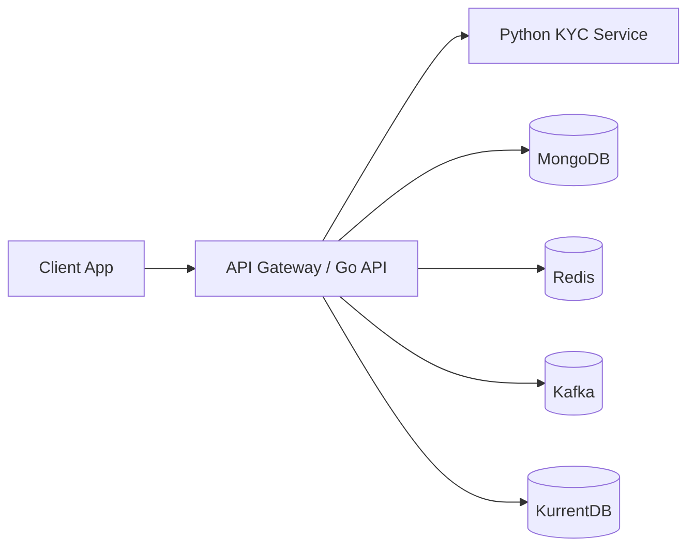

# Anomaly Python Service

Python service for face verification and active liveness in the Anomaly project.

## Overview

This service is planned as a dedicated KYC/vision backend that sits behind the main API gateway.

- Runtime: Python
- Responsibility: face verification and liveness processing
- Input: front image of Vietnamese CCCD + live video
- Output: verification decision, reason codes, and scoring metadata

## Architecture

## Planned Responsibilities

- Validate uploaded CCCD image and live video
- Detect and align the CCCD front image
- Extract the portrait region from the CCCD
- Run face quality checks on card portrait and live frames
- Evaluate active liveness from live video
- Generate face embeddings and compare CCCD portrait vs live face
- Return machine-readable decisions such as `VERIFIED`, `RETRY_ALLOWED`, and `FAILED_FINAL`

## Planned Service Layout

- `server/`: Go API and gateway-facing application logic
- `python-service/`: face verification and liveness processing service
- `client/`: Tauri client application
- `specs/`: product and technical design documents

## Notes

- This service is intended to remain behind the gateway rather than being exposed directly to clients.
- Thresholds for face match and liveness should be configured server-side.
- Retry policy is defined in `specs/Face-Verification-Design-Plan.md`.
