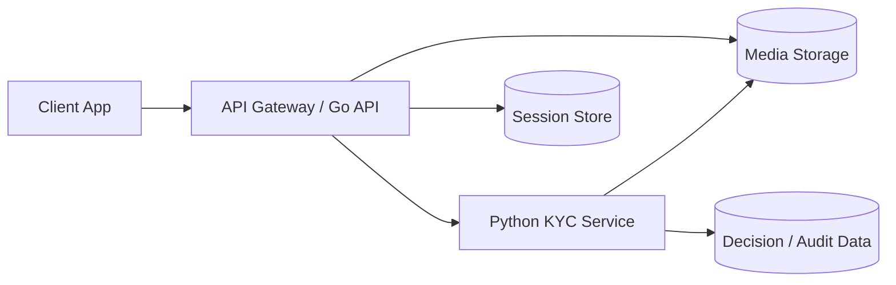

# Anomaly Python Service

Python service for face verification using a clear front image of a Vietnamese CCCD and a live video with active liveness.

## Purpose

This service is the dedicated KYC/vision backend for the face verification flow described in `specs/Face-Verification-Design-Plan.md`.

Current feature target:

- extract the portrait from the front side of a clear CCCD image
- compare that portrait with the user's live face from video
- verify active liveness before accepting the match
- allow a limited retry flow controlled by the gateway/session layer

## Scope

In scope:

- CCCD front image validation
- card detection and alignment
- portrait extraction
- live video preprocessing
- active liveness checks
- face embedding and 1:1 verification
- decision scoring and reason codes

Out of scope:

- full CCCD OCR
- passive-only liveness flows
- manual review tooling
- direct public exposure to clients

## Architecture

Responsibilities by component:

- `client/`: captures CCCD front image and live video
- `server/`: owns auth, rate limiting, request validation, session orchestration, and normalized API responses
- `python-service/`: runs image/video processing, liveness, face matching, and scoring
- storage/session systems: keep media, verification session state, and audit metadata

## Processing Pipeline

### 1. CCCD processing
1. Validate uploaded image format and basic constraints.
2. Detect the CCCD in the image.
3. Align the card to a normalized perspective.
4. Crop the portrait region using a template-based layout.
5. Confirm a face exists in the cropped portrait.
6. Run quality checks:
   - blur
   - brightness
   - glare
   - occlusion
   - face size

### 2. Live video processing
1. Validate video format, duration, and file constraints.
2. Extract candidate frames.
3. Detect the face across frames.
4. Ensure a single consistent subject is present.
5. Evaluate active liveness challenges:
   - blink
   - turn left
   - turn right
6. Select the best valid live frames for matching.

### 3. Face verification
1. Generate an embedding from the CCCD portrait.
2. Generate embeddings from the best live frames.
3. Compute similarity scores.
4. Combine:
   - match score
   - liveness score
   - quality checks
5. Return a final decision.

## Suggested Tech Stack

- `OpenCV`: card detection, alignment, and basic image quality checks
- `MediaPipe`: landmarks, blink detection, head turn checks, and active liveness signals
- `face_recognition` or another license-safe embedding model: face embedding and comparison
- `FastAPI`: service API layer

## API Role

This service is intended to sit behind the gateway. The gateway should own the public contract. The Python service should expose internal endpoints that the gateway can call for orchestration.

Suggested internal capabilities:

- `POST /extract-id-face`
- `POST /run-liveness`
- `POST /match-face`
- `POST /verify-face`

If the gateway exposes a single end-to-end endpoint, `python-service` can still keep these internal steps separate in code for maintainability.

## Decision Model

Expected high-level outcomes:

- `VERIFIED`
- `RETRY_ALLOWED`
- `FAILED_FINAL`
- `SYSTEM_ERROR`

Expected reason codes include:

- `CCCD_IMAGE_QUALITY_LOW`
- `CCCD_PORTRAIT_NOT_FOUND`
- `LIVE_FACE_NOT_FOUND`
- `MULTIPLE_FACES_DETECTED`
- `LIVE_VIDEO_QUALITY_LOW`
- `FACE_OCCLUDED`
- `LIVENESS_CHALLENGE_FAILED`
- `LIVENESS_NOT_CONFIDENT`
- `FACE_MISMATCH`
- `SESSION_EXPIRED`
- `INTERNAL_ERROR`

## Retry Policy

Retry policy is defined by the verification session, but this service must return outputs that support it.

Default behavior from the spec:

- maximum `3` attempts per verification session
- retryable failures should return clear machine-readable reason codes
- system failures should not consume an attempt
- exhausted attempts should end in `FAILED_FINAL`

This service should not make hidden retry decisions on behalf of the gateway. It should return enough information for the gateway to apply policy consistently.

## Security and Privacy

- treat CCCD portraits, live video, and embeddings as sensitive biometric data
- do not log raw image or video payloads in application logs
- store media only as long as required by policy
- keep thresholds and anti-spoof logic server-side
- assume all client traffic arrives through the gateway, not directly

## Implementation Notes

- Start with clear CCCD images only. Reject poor inputs early instead of trying to recover low-quality captures.
- Prefer template-based portrait extraction for MVP after alignment.
- Use active liveness as the primary anti-spoof layer for MVP.
- Keep thresholds configurable so they can be calibrated later with real test data.

## Reference

- Spec: `specs/Face-Verification-Design-Plan.md`
